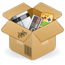

<!-- <p align="center">
  
</p> -->
<h1 align="center">Replay</h1>
<!-- <p align="center">
  <a href="https://appcenter.elementary.io/com.github.avojak.replay"></a>
</p> -->

## Replay the Classics!

Replay is a native Linux multi-system emulator built in Vala and GTK for [elementary OS](https://elementary.io).

|  |  |
|------------------------------------------------------------------|------------------------------------------------------------------|

### Included Cores

Replay ships with several [libretro](https://www.libretro.com) cores that are licensed in such a way which permit redistribution under the GPLv3 license:

| Name | Emulation Platforms | License |
| ---- | ------------------ | ------- |
| mGBA | Nintendo Game Boy<br>Nintendo Game Boy Color<br>Nintendo Game Boy Advance | MIT |

Additional cores can be easily imported.

### Included Games

Replay ships with several games that are licensed in such a way which permits redistribution under the GPLv3 license:

| Name | Platform |
| ---- | -------- |

Additional games can be easily added to the library.

## Install from Source

You can install Replay by compiling from source. Here's the list of
dependencies required:

- `libgranite (>= 6.2.0)`
- `libgtk-3-dev (>= 3.24.20)`
- `libgee-0.8-dev (>= 3.24.20)`
- `libhandy-1-dev (>= 1.2.0)`
- `retro-gtk-1 (>= 1.0.2)`
- `meson`
- `valac (>= 0.28.0)`

An `install-dev-dependencies.sh` script is available to help developers get up and running.

## Building and Running

```
$ meson build --prefix=/usr
$ sudo ninja -C build install
$ com.github.avojak.replay
```

### Flatpak

Flatpak is the preferred method of building Replay to ensure that built-in cores and core info are included:

```bash
$ flatpak-builder build com.github.avojak.replay.yml --user --install --force-clean
$ flatpak run --env=G_MESSAGES_DEBUG=all com.github.avojak.replay
```

### Updating Translations

When new translatable strings are added, ensure that `po/POTFILES` contains a
reference to the file with the translatable string.

Update the `.pot` file which contains the translatable strings:

```
$ ninja -C build com.github.avojak.replay-pot
```

Generate translations for the languages listed in the `po/LINGUAS` files:

```
$ ninja -C build com.github.avojak.replay-update-po
```

## Installing Additional Cores

TODO

## Installing Additional Games

TODO

## Related Projects

For my work on developing a Game Boy emulator written in Vala, check out [Vee](https://github.com/avojak/vee)!

---

## Copyright Notice

Replay is not affiliated, associated, authorized, endorsed by, or in any way officially connected with Nintendo&reg;, or any of its subsidiaries or its affiliates. Game Boy&trade; is a registered trademark of Nintendo Corporation.

All other product names mentioned herein, with or without the registered trademark symbol &reg; or trademark symbol &trade; are generally trademarks and/or registered trademarks of their respective owners.

## Disclaimer

Replay is not designed to enable illegal activity. We do not promote piracy, and Replay users are expected to follow all applicable local laws.